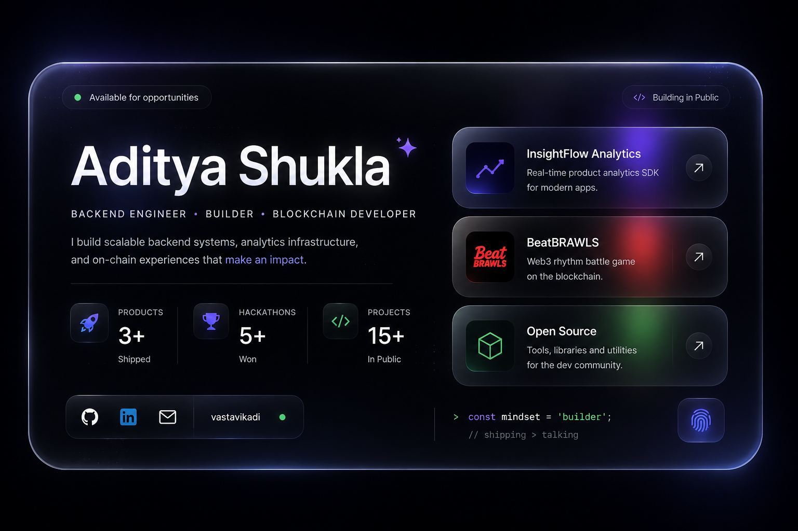

<div align="center">

<p align="center">
  
</p>

</div>

<div align="center">

[](https://git.io/typing-svg)

</div>

<div align="center">

&nbsp;
[](https://github.com/vastavikadi?tab=followers)&nbsp;
[](https://github.com/vastavikadi)

</div>

<br/>

---

## 🧠 `whoami`

```typescript
const vastavikadi = {
  name     : "Aditya Shukla",
  alias    : "vastavikadi",
  location : "India 🇮🇳",
  status   : "Building · Exploring · Shipping",

  focus    : [
    "Full Stack Development",
    "Web3 / Blockchain",
    "AI Agents & LLM Engineering",
    "Distributed Systems",
  ],

  currentlyBuilding : "OperaAI: An AI-First Linux Distribution — rethinking the operating system experience with artificial intelligence at its core.",
  hackathons        : "🏆 1st Place · IIT Delhi Tryst",
  openTo            : ["Internships", "Collabs", "Open-Source", "Late-night builds"],

  philosophy : "Discipline is the only key to success.",
  funFact    : "I break things at 2 AM and somehow fix them before sunrise ✨",
};
```


### A bit more about me —

- 🔭 Currently shipping **[OperaAI — AI-First Linux Distribution](https://github.com/vastavikadi/operaai)** — An AI-First Linux Distribution — rethinking the operating system experience with artificial intelligence at its core.
- ⛓️ Deep into **Web3 protocols, IPFS, and decentralized apps**
- 🤖 Obsessed with **AI Agents, RAG pipelines & LLM tooling**
- 🏆 **1st Place** at IIT Delhi Tryst Hackathon
- 🌐 Personal corner of the internet: **[vastavikadi.space](https://vastavikadi.space)**
- 💬 Ask me about **TypeScript · Next.js · Go · Solidity · AI/ML · Linux · Web3**
- 🌱 Always learning — currently: **distributed systems & zero-knowledge proofs**
- ⚡ I ship, break, learn, repeat

<br clear="right"/>

---

## 🛠️ Tech Arsenal

<div align="center">

### Frontend & UI
[](https://skillicons.dev)

### Backend & APIs
[](https://skillicons.dev)

### Databases & Infrastructure
[](https://skillicons.dev)

### ⛓️ Web3 & Blockchain Stack


</div>

---

## 🚀 Featured Projects

<div align="center">
<br/>

> *A curated selection of projects spanning AI/ML, Web3, distributed systems, and full-stack engineering.*

<br/>
</div>

<table>
<tr>
<td width="50%" valign="top">

### ☀️ [Surya-Plus](https://github.com/vastavikadi/Surya-Plus)

<p><em>Real-time solar flare forecasting platform leveraging IBM-NASA's Surya foundation model for space weather monitoring & risk management.</em></p>

<p>


</p>

<p>
<code>🛰️ IBM-NASA Surya Model</code> · <code>🔬 Solar Weather</code> · <code>📡 Real-time Forecasting</code>
</p>

</td>
<td width="50%" valign="top">

### 🎯 [Multimodal Job Extractor](https://github.com/vastavikadi/multimodal-job-extractor)

<p><em>Multimodal data ingestion pipeline that converts Instagram job reels into structured records using OCR, speech recognition & LLM extraction.</em></p>

<p>


</p>

<p>
<code>🧠 LLM Extraction</code> · <code>👁️ EasyOCR</code> · <code>🎤 Faster-Whisper</code> · <code>📊 Astra DB</code>
</p>

</td>
</tr>
</table>

<table>
<tr>
<td width="50%" valign="top">

### 📊 [InsightFlow](https://github.com/vastavikadi/insight-flow)

<p><em>Lightweight full-stack user analytics platform inspired by Google Analytics — with tracker SDK, ingestion API, heatmaps & funnel analytics.</em></p>

<p>


</p>

<p>
<code>📈 Heatmaps</code> · <code>🔄 Session Replay</code> · <code>🛒 E-Commerce Demo</code> · <code>📦 Tracker SDK</code>
</p>

<p>
<a href="https://insightflow-pi.vercel.app/dashboard">

</a>
</p>

</td>
<td width="50%" valign="top">

### 🖥️ [OperaAI](https://github.com/vastavikadi/OperaAI)

<p><em>An AI-First Linux Distribution — rethinking the operating system experience with artificial intelligence at its core.</em></p>

<p>


</p>

<p>
<code>🐧 Linux Kernel</code> · <code>🤖 AI-Enhanced</code> · <code>⚡ Intelligent Ops</code> · <code>🔧 System API</code>
</p>

</td>
</tr>
</table>

<table>
<tr>
<td width="50%" valign="top">

### 🔐 [LifeVault](https://github.com/vastavikadi/LifeVault---A-Decentralized-Data-Drive)

<p><em>Decentralized digital vault for securely managing & sharing essential documents — built on Hive blockchain & IPFS for trustless storage.</em></p>

<p>


</p>

<p>
<code>⛓️ Hive Blockchain</code> · <code>📁 IPFS Storage</code> · <code>🔑 Decentralized Auth</code>
</p>

</td>
<td width="50%" valign="top">

### 🕸️ [Distributed Web Scraper](https://github.com/vastavikadi/Distributed-Web-Scraper)

<p><em>A distributed web scraping system designed for scalability and resilience — coordinating multiple workers across a scraping cluster.</em></p>

<p>


</p>

<p>
<code>🌐 Multi-Worker</code> · <code>⚡ High Performance</code> · <code>🔄 Auto-Retry</code> · <code>📊 Data Pipeline</code>
</p>

</td>
</tr>
</table>

---

## 📊 GitHub Analytics

<div align="center">


</div>

<div align="center">


</div>

---

<!-- ## 🏆 Trophy Cabinet

<div align="center">

[](https://github.com/ryo-ma/github-profile-trophy)

</div>

--- -->

## 📈 Contribution Pulse

<div align="center">

[](https://github.com/ashutosh00710/github-readme-activity-graph)

</div>

---

## 🐍 Contribution Snake

<div align="center">

<picture>
  <source media="(prefers-color-scheme: dark)"  srcset="https://raw.githubusercontent.com/vastavikadi/vastavikadi/output/github-contribution-grid-snake-dark.svg"/>
  <source media="(prefers-color-scheme: light)" srcset="https://raw.githubusercontent.com/vastavikadi/vastavikadi/output/github-contribution-grid-snake.svg"/>
  
</picture>

> 🔧 *Activate the snake: add `.github/workflows/snake.yml` (included in this repo package)*

</div>

---

## 🎖️ Certifications & Badges

<div align="center">

&nbsp;

[](https://api.badgr.io/public/assertions/xOGHYTfLRJe0OcbYaiyoyg)
[](https://www.credly.com/earner/earned/badge/8769c29e-b885-4451-a5cd-47f3f1c25c60)
[](https://www.credly.com/earner/earned/badge/8e894a5b-fa12-42e7-89d1-a531e9629b45)

</div>

---

## 🌐 Find Me Online

<div align="center">

[](https://vastavikadi.space)&nbsp;
[](https://linkedin.com/in/vastavikadi)&nbsp;
[-000000?style=for-the-badge&logo=x&logoColor=white)](https://x.com/vastavikadi)&nbsp;
[](https://linktr.ee/vastavikadi)

</div>

---

<div align="center">


<br/><br/>


</div>